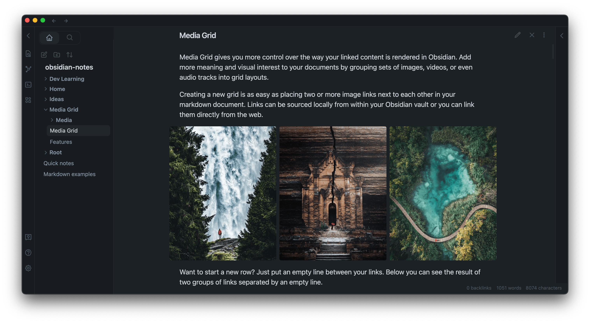
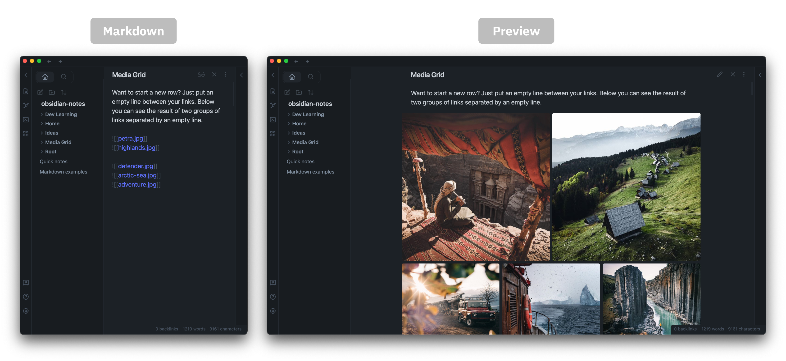
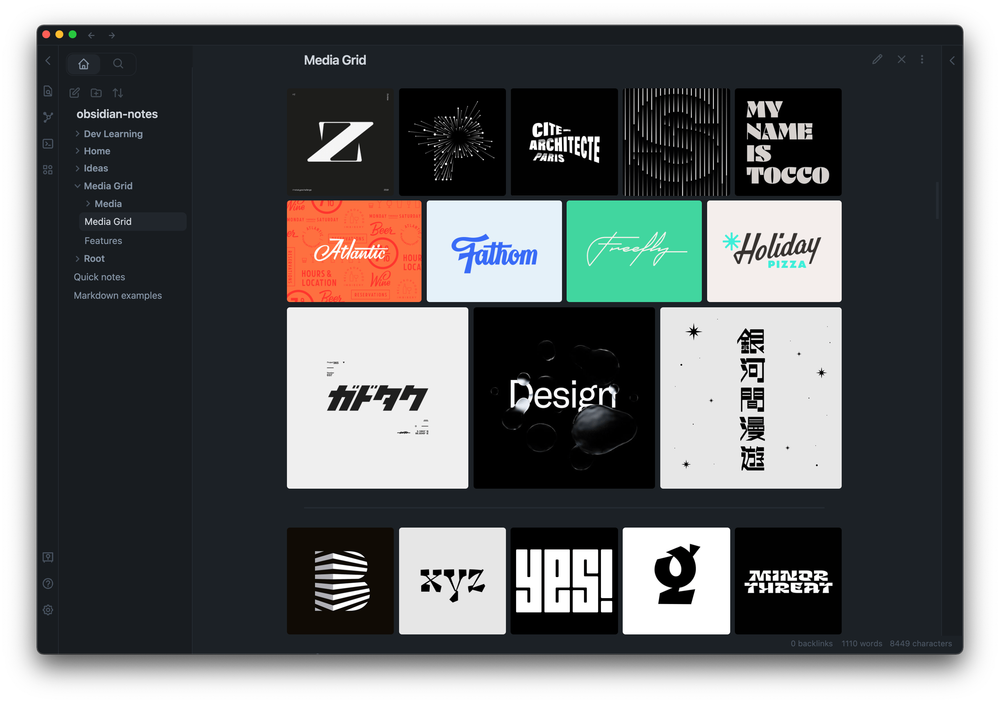
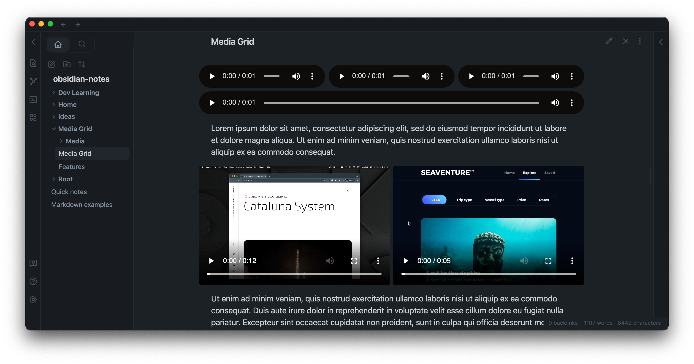
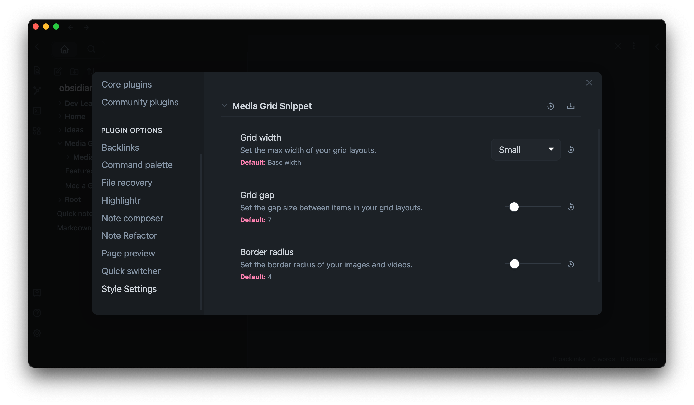

# Media Grid
*An [Obsidian](https://obsidian.md/) snippet*

[Skip to installation instructions](#installation) ↓

## Introduction

Media Grid gives you more control over the way your linked content is rendered in Obsidian. Add more meaning and visual interest to your documents by grouping sets of images, videos, or even audio tracks into grid layouts.

Creating a new grid is as easy as placing two or more image links next to each other in your markdown document. Below you can see the result of three links.

Want to start a new row? Just put an empty line between your links. Below you can see the result of two groups of links separated by an empty line. 😎

Awesome for throwing together a quick moodboard or collecting ideas for your next project.

It works with audio and video files too!

## Make it yours

Media Grid looks great out of the box but can be further configured to your liking through the [Style Settings Plugin](https://github.com/mgmeyers/obsidian-style-settings) (not required).

## Installation

**NOTE**: This snippet requires the latest version of [Contextual Typography](https://github.com/mgmeyers/obsidian-contextual-typography).  
If you already have the latest version of Contextual Typography:

1. Download `media-grid-snippet.css` from this repo.
2. Open the settings panel in Obsidian and click the Appearance tab.
3. Scroll to "CSS snippets" and click the folder icon.
4. Drop `media-grid-snippet.css` into the folder that appears.
5. Now back in Obsidian, next to "CSS snippets", click the "Reload snippets" button.
6. You should now see `media-grid-snippet` in the list. Toggle it on and you're ready to go! 🥳

## Feedback

If you run into any issues or have suggestions feel free to submit a GitHub issue or send me a message [@zremboldt on Twitter](https://twitter.com/zremboldt). I'll respond as soon as I can. 👍

## Support

No pressure whatsoever but if you enjoy Media Grid and would like to support its development you can [buy me a coffee](https://www.buymeacoffee.com/zremboldt). Thank you! 😄

